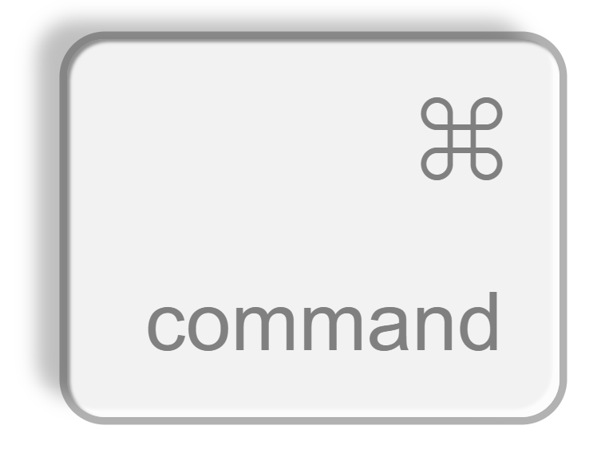

<div align="center">
<a href="https://bn-l.github.io/clean-components"></a>
</div>

<br />

<div align="center">
    Clean, modular, tested, highly customisable, tree-shake-able react components for everyday needs.
</div>
<br />
<div align="center">
    <a href="https://www.npmjs.com/package/clean-components" target="_blank"></a>
</div>

<br />

## Install

```bash
npm i clean-components
```

## Components

### DarkModeSwitch

<a href="https://bn-l.github.io/clean-components/?path=/docs/theming-darkmodeswitch--docs" target="_blank">Demo</a> 

<a href="https://bn-l.github.io/clean-components/?path=/docs/theming-darkmodeswitch--docs" target="_blank"></a>

<p>By default adds a "light" or "dark" color class name to the html element when the switch is 
toggled. It also:
 - Stores this value to localstorage using the key: "darkmodeswitch-theme"
 - Respects the user's / system darkmode preference (this becomes the default starting theme)
 - Listens for changes to the dark mode media query and responds (e.g. if the user's os changes
    the preference from light to dark at a certain time of day, the component will update).
</p>

### Keycap

<a href="https://bn-l.github.io/clean-components/?path=/docs/misc-keycap--docs" target="_blank">Demo</a> 

<a href="https://bn-l.github.io/clean-components/?path=/docs/misc-keycap--docs" target="_blank"></a>

<p>Can be scaled to almost any size (will depend on the smallest font the browser will show).
To use in a simulated keyboard, iterate over an array of [word, char] pairs, where word is
a word like "command" and char is an svg component (for symbol keys) or a character. 
Keypress visuals can be done by listening for key down and checking in the loop if the current
key matches the keydown key.</p>