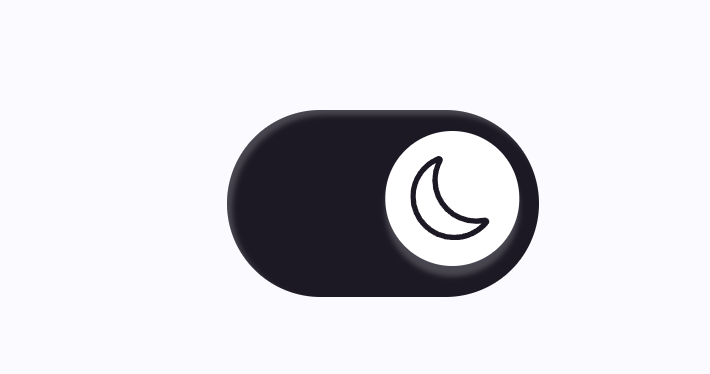

# Clean Components

Clean, modular, tested, highly customisable, tree-shake-able react components for everyday needs

## Components

### DarkModeSwitch

[Demo](https://bn-l.github.io/clean-components/?path=/docs/theming-darkmodeswitch--docs)

 